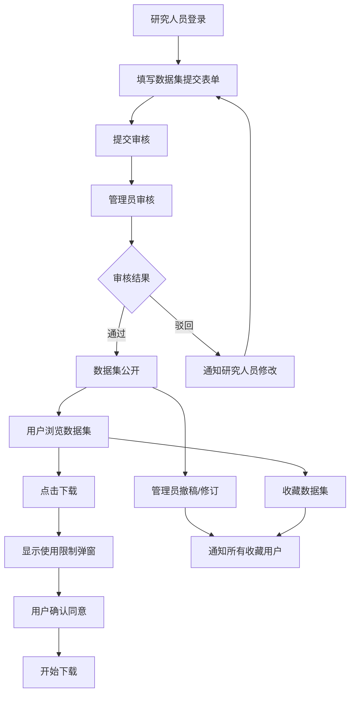

## 1. 产品概述

科研数据集引用目录系统，为研究人员提供数据集提交、引用管理和版本追踪平台，为用户提供规范的数据集发现、下载与引用服务，通过管理员审核机制保障数据质量。

- 解决科研数据集引用不规范、版本追踪困难、使用限制不明确的问题
- 面向研究人员、数据管理员、普通科研用户三类角色
- 目标是建立标准化的数据集引用生态，提升科研数据可追溯性与复用价值

## 2. 核心功能

### 2.1 用户角色

| 角色 | 注册方式 | 核心权限 |
|------|----------|----------|
| 访客 | 无需注册 | 浏览公开数据集列表、查看详情 |
| 研究人员 | 邮箱注册登录 | 提交数据集申请、查看自己的提交记录、收藏数据集 |
| 普通用户 | 邮箱注册登录 | 浏览数据集、下载数据（需确认使用限制）、收藏数据集、接收通知 |
| 管理员 | 系统预设账号 | 审核数据集、管理用户、撤稿/修订数据集、发布系统通知 |

### 2.2 功能模块

1. **首页**：导航栏、数据集搜索与筛选、最新/热门数据集展示、统计概览
2. **数据集列表页**：多维度筛选（领域、许可证、时间）、排序、分页
3. **数据集详情页**：完整元数据展示、字段说明、引用格式、使用限制声明、下载入口、收藏按钮、修订历史
4. **数据集提交页**：研究人员填写数据集名称、采集时间、许可证、字段说明、引用格式、使用限制
5. **审核管理页**：管理员审核待提交数据集、查看详情、通过/驳回操作
6. **用户中心页**：个人信息、收藏列表、提交记录、消息通知、下载记录
7. **通知中心页**：系统通知、数据集撤稿/修订通知、收藏变更提醒

### 2.3 页面详情

| 页面名称 | 模块名称 | 功能描述 |
|----------|----------|----------|
| 首页 | 顶部导航 | 登录/注册入口、角色切换、搜索框、通知图标 |
| 首页 | Hero区域 | 平台使命标语、数据集总数、下载量统计、快速搜索 |
| 首页 | 最新数据集 | 卡片式展示最新通过审核的6个数据集 |
| 首页 | 热门领域 | 按研究领域分类展示数据集数量 |
| 数据集列表页 | 筛选侧边栏 | 研究领域、许可证类型、发布时间、下载量筛选 |
| 数据集列表页 | 数据列表 | 卡片列表展示，含标题、作者、许可证、下载量、收藏数 |
| 数据集详情页 | 元数据区 | 数据集名称、作者、采集时间、版本、DOI、许可证 |
| 数据集详情页 | 字段说明 | 表格展示字段名、类型、描述、示例值 |
| 数据集详情页 | 引用格式 | BibTeX/APA/MLA等多格式切换与一键复制 |
| 数据集详情页 | 使用限制 | 醒目展示使用条款（商用限制、署名要求等），下载前需勾选确认 |
| 数据集详情页 | 修订历史 | 版本记录、变更说明、时间线展示 |
| 数据集详情页 | 收藏/下载 | 收藏按钮、下载按钮（带确认弹窗） |
| 数据集提交页 | 表单区 | 多步骤表单：基本信息→字段定义→引用格式→使用限制→提交预览 |
| 审核管理页 | 待审核列表 | 表格展示待审核数据集，支持快速查看与操作 |
| 审核管理页 | 审核详情弹窗 | 完整信息展示，通过/驳回（附原因）操作 |
| 用户中心页 | 个人资料 | 头像、姓名、机构、邮箱、角色 |
| 用户中心页 | 收藏列表 | 已收藏的数据集卡片，可取消收藏、跳转详情 |
| 用户中心页 | 我的提交 | 提交历史与审核状态展示 |
| 用户中心页 | 消息通知 | 撤稿/修订通知、审核结果通知、系统公告 |

## 3. 核心流程

研究人员登录后填写数据集提交表单，系统将状态标记为"待审核"；管理员在审核页面查看详情，可通过（数据集进入公开列表）或驳回（通知研究人员修改）；普通用户浏览公开数据集，点击下载前弹出使用限制确认弹窗，勾选同意后可下载；用户可收藏感兴趣的数据集；当数据集被撤稿或修订时，系统自动向所有收藏用户推送通知。

## 4. 用户界面设计

### 4.1 设计风格

- **主色调**：学术蓝 `#1e3a5f`（专业、可信赖），辅助色：数据绿 `#0d9488`（通过/成功）、警示橙 `#f59e0b`（待审核）、错误红 `#dc2626`（驳回/撤稿）
- **按钮样式**：圆角6px，轻微阴影，hover状态颜色加深15%，active状态有按压反馈
- **字体**：标题使用 "Noto Serif SC"（学术感衬线体），正文使用 "Inter"（现代无衬线体），代码/引用格式使用 "JetBrains Mono"
- **布局风格**：顶部导航 + 卡片式内容布局，大量留白，层次分明，符合学术出版审美
- **图标风格**：线性简洁图标（Lucide Icons），与学术调性一致

### 4.2 页面设计概览

| 页面名称 | 模块名称 | UI元素 |
|----------|----------|--------|
| 首页 | Hero区域 | 深蓝渐变背景 + 学术插图，大号衬线标题，白色半透明统计卡片，圆角搜索框 |
| 首页 | 数据集卡片 | 白色卡片、细边框、hover阴影上浮，许可证标签色区分，收藏数/下载数图标 |
| 数据集详情页 | 使用限制区 | 浅黄色背景边框警告框，粗体标题，带复选框的确认按钮 |
| 数据集详情页 | 引用格式区 | 灰色代码块背景，格式切换Tab，右上角一键复制按钮带提示动画 |
| 数据集详情页 | 修订历史 | 左侧时间线竖线 + 圆点，右侧版本号与变更说明卡片 |
| 数据集提交页 | 多步骤表单 | 顶部步骤指示器（已完成绿、当前蓝、未完成灰），左侧表单右侧实时预览 |
| 审核管理页 | 状态标签 | 待审核橙、已通过绿、已驳回红、已撤稿灰 |
| 通知中心 | 通知项 | 未读左侧蓝条标记，hover背景浅灰，撤稿通知红色强调 |

### 4.3 响应式设计

- 桌面端优先（1440px基准），适配平板（768px）与移动端（375px）
- 移动端：侧栏筛选收起为下拉菜单，卡片改为单列，导航折叠为汉堡菜单
- 触摸优化：按钮最小触控区域44×44px，表单输入框适配软键盘弹出

### 4.4 动效设计

- 页面加载：骨架屏→内容渐入（200ms ease-out）
- 卡片hover：y轴-4px上浮 + 阴影加深（150ms）
- 收藏按钮：点击后心形图标填充色动画 + 轻微弹跳
- 通知角标：新消息到达时数字红色脉冲动画
- 步骤表单切换：内容区左右滑入过渡
