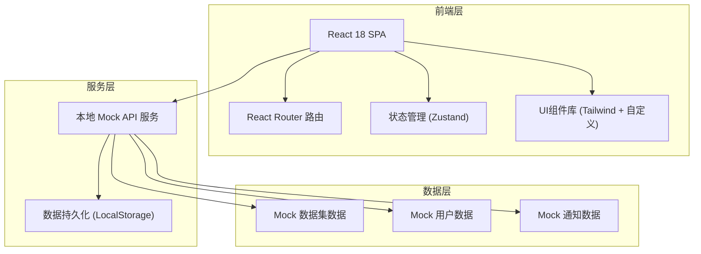
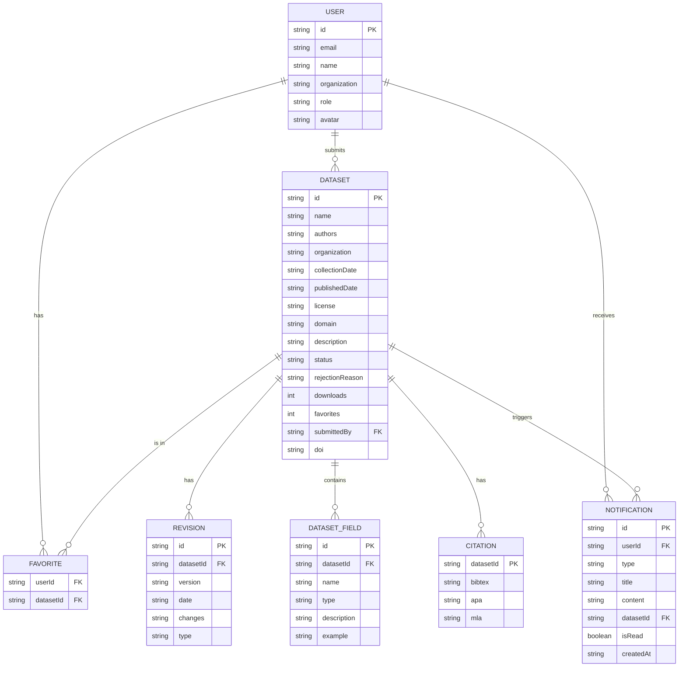

## 1. 架构设计



## 2. 技术描述

- **前端框架**：React@18 + TypeScript@5 + Vite@5
- **样式方案**：TailwindCSS@3 + PostCSS + 自定义CSS变量主题
- **路由管理**：React Router@6
- **状态管理**：Zustand@4（轻量级状态管理，含持久化中间件）
- **图标库**：Lucide React
- **初始化工具**：npm create vite@latest
- **后端方案**：无真实后端，使用 Mock API + LocalStorage 持久化模拟完整后端行为
- **数据方案**：前端内置 Mock 数据，通过 Zustand store 管理，变更同步到 LocalStorage

## 3. 路由定义

| 路由路径 | 页面组件 | 用途 |
|----------|----------|------|
| `/` | HomePage | 首页，展示平台概览与最新数据集 |
| `/datasets` | DatasetListPage | 数据集列表，支持筛选、搜索、排序 |
| `/datasets/:id` | DatasetDetailPage | 数据集详情，含元数据、引用格式、下载入口 |
| `/submit` | SubmitDatasetPage | 研究人员提交新数据集 |
| `/admin/review` | AdminReviewPage | 管理员审核数据集（需管理员角色） |
| `/user/profile` | UserProfilePage | 用户中心 - 个人资料 |
| `/user/favorites` | UserFavoritesPage | 用户中心 - 收藏列表 |
| `/user/submissions` | UserSubmissionsPage | 用户中心 - 我的提交 |
| `/user/notifications` | UserNotificationsPage | 用户中心 - 通知消息 |
| `/login` | LoginPage | 登录页面 |
| `/register` | RegisterPage | 注册页面 |
| `/404` | NotFoundPage | 404页面 |

## 4. API 接口定义（Mock）

### 4.1 TypeScript 类型定义

```typescript
type DatasetStatus = 'pending' | 'approved' | 'rejected' | 'retracted';

interface DatasetField {
  name: string;
  type: 'string' | 'number' | 'boolean' | 'date' | 'array' | 'object';
  description: string;
  example?: string;
}

interface CitationFormat {
  bibtex: string;
  apa: string;
  mla: string;
}

interface Revision {
  version: string;
  date: string;
  changes: string;
  type: 'update' | 'retraction';
}

interface Dataset {
  id: string;
  name: string;
  authors: string[];
  organization?: string;
  collectionDate: string;
  publishedDate: string;
  license: string;
  domain: string;
  description: string;
  fields: DatasetField[];
  citation: CitationFormat;
  usageRestrictions: string[];
  status: DatasetStatus;
  rejectionReason?: string;
  downloads: number;
  favorites: number;
  revisions: Revision[];
  submittedBy: string;
  doi?: string;
}

type UserRole = 'visitor' | 'researcher' | 'user' | 'admin';

interface User {
  id: string;
  email: string;
  name: string;
  organization?: string;
  role: UserRole;
  avatar?: string;
  favoriteDatasetIds: string[];
}

type NotificationType = 'review_result' | 'dataset_retracted' | 'dataset_updated' | 'system';

interface Notification {
  id: string;
  userId: string;
  type: NotificationType;
  title: string;
  content: string;
  datasetId?: string;
  isRead: boolean;
  createdAt: string;
}
```

### 4.2 Mock API 方法

| 方法名 | 参数 | 返回值 | 说明 |
|--------|------|--------|------|
| `getDatasets(filters?)` | filters?: 筛选条件 | `Dataset[]` | 获取公开数据集列表 |
| `getDatasetById(id)` | id: string | `Dataset \| undefined` | 获取单个数据集详情 |
| `submitDataset(data)` | data: 提交表单数据 | `Dataset` | 研究人员提交新数据集 |
| `reviewDataset(id, decision, reason?)` | id, decision, reason? | `Dataset` | 管理员审核通过/驳回 |
| `retractDataset(id, reason)` | id, reason | `Dataset` | 管理员撤稿数据集 |
| `reviseDataset(id, revisionData)` | id, revisionData | `Dataset` | 管理员/作者修订数据集 |
| `getPendingDatasets()` | - | `Dataset[]` | 获取待审核数据集列表 |
| `getUserSubmissions(userId)` | userId | `Dataset[]` | 获取用户的提交记录 |
| `toggleFavorite(userId, datasetId)` | userId, datasetId | `boolean` | 收藏/取消收藏 |
| `getUserFavorites(userId)` | userId | `Dataset[]` | 获取用户收藏列表 |
| `recordDownload(datasetId)` | datasetId | `void` | 记录下载量+1 |
| `login(email, password)` | email, password | `User \| null` | 用户登录 |
| `register(userData)` | userData | `User` | 用户注册 |
| `getUserNotifications(userId)` | userId | `Notification[]` | 获取用户通知列表 |
| `markNotificationRead(id)` | id | `void` | 标记通知已读 |
| `markAllNotificationsRead(userId)` | userId | `void` | 全部标记已读 |

## 5. 数据模型

### 5.1 ER 图



### 5.2 初始 Mock 数据

预置5个已审核通过的公开数据集（覆盖计算机、医学、环境、天文、社科领域），2个待审核数据集，3个用户账号（管理员/研究人员/普通用户各1），以及若干示例通知数据，确保系统可直接演示完整流程。
